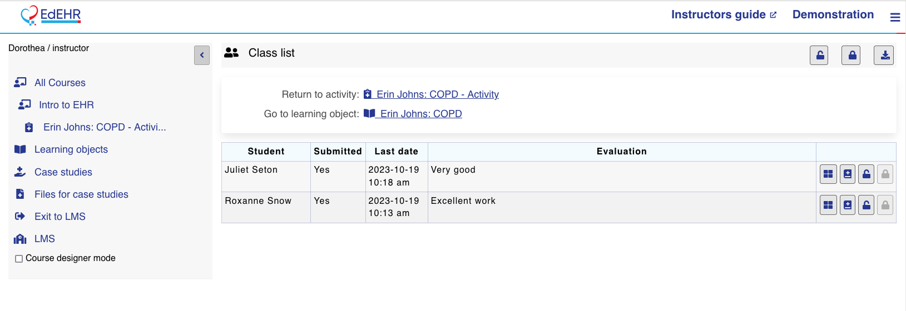

# Evaluating Student Work

This page is your guide to evaluating student work in EdEHR. It covers everything from managing submissions to providing feedback and exporting evaluation data. Use the links below to jump directly to the section you need.

On this page, you can find:

* [How to manage submission status for the whole class or individual students](evaluating-student-work.md#submission-status-management)
* [The different ways to evaluate student work (Condensed View and EHR View)](evaluating-student-work.md#evaluation-methods)
* [Using the evaluation panel to add feedback and navigate between students](evaluating-student-work.md#evaluation-panel)
* [Downloading evaluation notes as a CSV file](evaluating-student-work.md#downloading-evaluation-data)
* [Tips for importing evaluation data into your LMS](evaluating-student-work.md#importing-evaluation-notes-to-lms)

***

### Submission status management

Only when a student's work is "submitted" can an instructor review and comment on it. Students normally submit their work, but instructors can toggle the submission status:



### Toggle Submission status for the entire class list:

<figure><figcaption></figcaption></figure>

Apply to whole class Actions:&#x20;

*   **Force Submission:** Allow students to view but prevents further editing
*   **Download All Students Evaluations in CSV**
*   **All Students can Edit**: Allows all students to continue editing




### Toggle Submission status for individual students:

<figure><figcaption></figcaption></figure>

Apply to whole class Actions:&#x20;

*   **Force Submission:** Allow students to view but prevents further editing
*   Evaluate the Students work
*   View and Evaluate the Students work in the EHR Context
*   **Download All Students Evaluations in CSV**
*   **All Students can Edit**: Allows all students to continue editing



***

### Evaluation methods

A student's work can be evaluated using two methods; [Condensed View](evaluating-student-work.md#condensed-view-evaluate-button) or [EHR View.](evaluating-student-work.md#ehr-view-eval-in-ehr-button)&#x20;

#### **Condensed View** ("Evaluate" button):

<figure><figcaption></figcaption></figure>

* Shows only the student's work without base case data
* Pages with tables include a button to toggle table orientation
* Draft records appear with amber coloring
* Displays tabs for each patient involved in the student's work

#### **EHR View** ("Eval in EHR" button):

* Shows the student's work within the full EHR interface
* Includes both student work and base case study

<figure><figcaption></figcaption></figure>

* In the navigation panel:
  * Solid green dot: Page with student data
  * Empty green circle: Page with Case Study data
  * Red dot: Page with draft record (typically unverified assessments)

<figure><figcaption></figcaption></figure>

***

### Evaluation panel

In both views, instructors see a persistent evaluation panel that includes:

* Notes section for feedback
* Save button for edits to notes
* Navigation controls to move forward/backward in the class list
* Buttons to force submission or send work back to students
* Option to switch between evaluation modes

<figure><figcaption></figcaption></figure>

***

### Downloading evaluation data

From the Activity page:

1. Select the link to the class list
2. Click "Download evaluation notes"
3. This downloads a CSV file named after the Activity, containing:
   * Student's given name
   * Student's family name
   * LMS user ID
   * Instructor's evaluation notes

### Importing evaluation notes to LMS

Schools place students' grading information in the learning management system. It's possible to import the CSV download file and map the data into the LMS. Check your LMS manual for instructions on importing this CSV file into the grade book.

